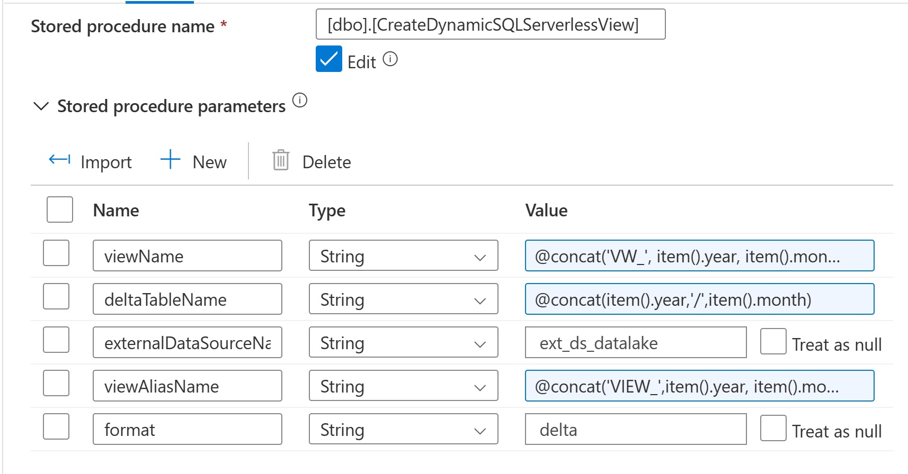
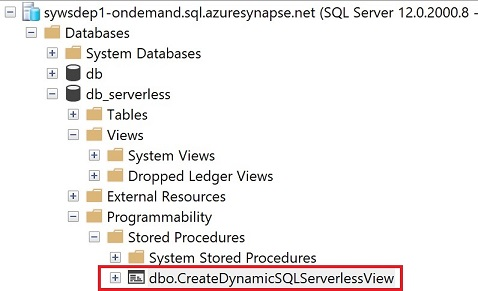
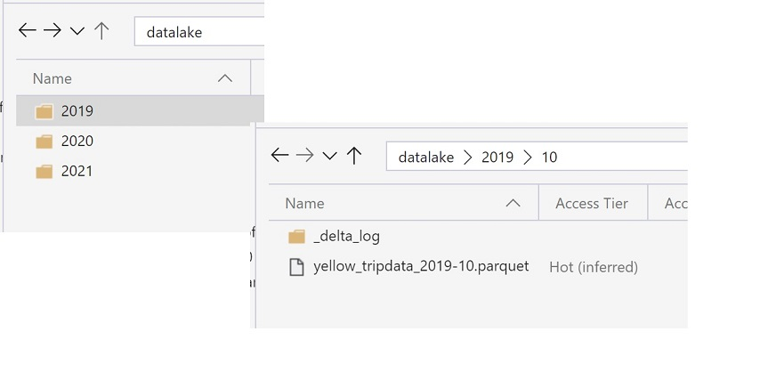
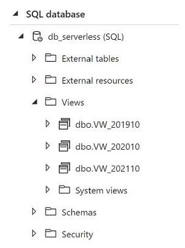

# Synapse Analytics Serverless Pools Best Practices using Delta Lake <!-- omit in toc -->

## Table of Contents <!-- omit in toc -->
- [Objectives](#objectives)
- [Key Learnings](#key-learnings)
- [Synapse Serverless with Delta files and Partitioned Views](#synapse-serverless-with-delta-files-and-partitioned-views)
  - [Dynamic view creation on top of delta files](#dynamic-view-creation-on-top-of-delta-files)
  - [Implementing CLS at the Delta Lake level](#implementing-cls-at-the-delta-lake-level)
- [Working with the Sample](#working-with-the-sample)
  - [Pre-requisites](#pre-requisites)
  - [Using Dev Containers](#using-dev-containers)
  - [Without using Dev Containers](#without-using-dev-containers)
  - [Running the Sample](#running-the-sample)
  - [Infrastructure deployment considerations](#infrastructure-deployment-considerations)
  - [Synapse Artifacts deployment considerations](#synapse-artifacts-deployment-considerations)
- [Removing the Sample](#removing-the-sample)
- [Issues and Workarounds](#issues-and-workarounds)
  - [Customer subscription \<SUBSCRIPTION\_ID\> needs to be registered with Microsoft.Sql resource provider](#customer-subscription-subscription_id-needs-to-be-registered-with-microsoftsql-resource-provider)
  - [I require jq but it's not installed. See jq](#i-require-jq-but-its-not-installed-see-jq)
  - [I require azure cli but it's not installed. See Az CLI](#i-require-azure-cli-but-its-not-installed-see-az-cli)
  - [Other issues](#other-issues)

## Objectives

This sample aims to demonstrate the use of Synapse Serverless Pools with Delta Lake files including the automation towards the CI initial deployment of the necessary artifacts and the automation of the dynamic views creation on top of the delta lake files. A second and related objective is to demonstrates how to implement CLS (Column Level Security) on the delta tables using the previously created views.

## Key Learnings

When using this sample, you will learn:

- how to automate SQL scripts as part of the initial deployment using a synapse pipeline. We advise to use the Script task in Synapse pipelines with the type Query and to configure dynamically the Linked Services artifacts to make the automation possible.
- to use partitioned views instead of external tables in order to work with Delta Lake and Serverless pools so you can still benefit from partition elimination when running queries
- how to use Stored Procedure Task for Serverless pools and gain the awareness that to see the stored procedures listed you need to do it in SSMS (SQL Server Management Studio)
- to implement CLS on top of the lake
- to use only ACLs on the data lake in order to allow to access to the Synapse workspace but not direct access to the storage account. The use of Azure roles (Storage Reader for example) is not recommended in this case as it is too permissive and ACLs allow for a more fined grained approach.

## Synapse Serverless with Delta files and Partitioned Views

Is known that the Delta format is supported within Synapse Serverless pools (which is not the case for Dedicated pools). Not surprinsingly, using Serverless pools seems like the right choice when the goal is to use Delta lake format and there is a strong requirement to use T-SQL like syntax and maintaining the costs as low as possible. However, there are some limitations to be aware of.

One natural choice is to use External tables on top of the Data Lake files, however External tables don't support partitioning on the Serverless pools, in this case when using Delta Lake files, [Partitioned Views](https://learn.microsoft.com/en-us/azure/synapse-analytics/sql/create-use-views#partitioned-views) need to be used instead:

` CREATE   VIEW [dbo].[VW_202010] As SELECT * FROM OPENROWSET(BULK '2020/10',DATA_SOURCE = 'ext_ds_datalake',FORMAT = 'delta')as [VIEW_202010]
`

### Dynamic view creation on top of delta files

An extra challenge when dealing with Delta Files is to expect a large number of tables (or folders) in the Data Lake. A great choice is to automatically create the partioned views on top of the Delta lake folders after they are created - one view per delta table, and as we are using Synapse, a good choice is to use Synapse pipelines.

There are three main aspects to consider in this process:

- Setup, that is responsible to automatically create a database within the serverless pool, creates a external data source to the data lake and a stored procedure in the serverless database that will be triggered later. This functionality is also aligned with the pipeline Pl_NYCTaxi_1_Setup. This pipeline needs to run before the P_NYCTaxi_2_CreateServerlessView pipeline.
- Get parquet data and transform it to delta format. In order to have testing data we are downloading some sample data from the NYC Taxi available open data to demonstrate the behaviour. The data is in parquet format and we take a second step to transform the same data to the delta format. We are taking data from October 2019, 2020 and 2021 as the latest data from NYC Taxi is not completely up to date to the month.
- Automatically creates partitioned views based on the delta lake file structure after its creation, the third pillar of the process is responsible to point to the data lake previously created folders and dynamically create the partitioned views on top of it. For that it uses the stored procedure that was created on the Setup pipeline as explained above.

The Stored Procedure will be responsible to dynamically create the views and expects the following parameters:

- view_name, build as a concatenation of "VW_" and the name of the delta lake tables
- external_datasource (created in the Setup pipeline as well), and it has a fixed name: ext_ds_datalake.
- format, on our case we are dealing with the delta format
- view_alias, build as a concatenation of "VIEW_" and the name of the delta lake tables
  


There is an important information about this process, that is relevant to mention. The Stored procedure needs to be created against the Serverless pool, and this is done in the P_NYCTaxi_1_Setup pipeline, however the "Programability" folder won't be available to navigate through the defined stored procedures in Synapse Studio. If there is a need to check the success of the stored procedure deployment, or a need to explore or test further on the serverless pool, a connection needs to be established to the serverless synapse endpoint through SSMS (SQL Server Management Studio) and explore the "Programability" folder as showed below:



Expect to find as many views as existing delta folders:





### Implementing CLS at the Delta Lake level

Column Level Security is one important requirement when it comes to data access and being able to authorize the right people to access to the rigth data and the right columns for a more granular level.

There is no out-of-the box mechanism in Azure to implement CLS in the files that are stored in the datalake, however there is a possibility to implement CLS though the use of views on top of the datalake files. Furthermore, we can take advantage of AD Groups to implement a one to many relationship (1 AD Group containing many users mapped to 1 DB User) that implements the access level at the AD Level and still be able to audit per individual user on the activity performed on the database.

The diagram below illustrates the step-by-step process in order to successfully define CLS on top of a datalake file through a view:


## Working with the Sample

### Pre-requisites

- Azure account
- Visual Studio Code

### Using Dev Containers

To use a Dev Container, you need to have the following software in addition to the previous pre-requisites:

- Docker
- Visual Studio Code Remote Development Extension Pack

In order to open the project in a container follow the following steps:

- Open Visual Studio Code and clone the repository.
- Use the .envtemplate file to create a synapsecontainer.env file with your values
- Hit Ctlr-Shift-P to open the command palette and type Dev Containers: Open Folder in Container ...
- When prompted, select the directory \modern-data-warehouse-dataops\single_tech_samples\synapseanalytics\sample2_synapseserverless
- Wait for the container to build, check the logs for more information:
  
  

### Without using Dev Containers

Clone the repository and follow this prerequisites in order to run the sample:

- Login to Azure az login
- Install jq
    ```sudo apt-get install jq```
- Install Az CLI
    ```curl -sL https://aka.ms/InstallAzureCLIDeb | sudo bash``` (for Ubunto or Debian).
- Define the following environment variables:
  - export PROJECT=<PROJECT_NAME>
  - export AZURE_SUBSCRIPTION_ID=<SUBSCRIPTION_ID>
  - export DEPLOYMENT_ID=dep1 (or any other string). NOTE: if the deployment fails, you need either to delete the resources created or use a different DEPLOYMENT_ID.
  - export AZURE_LOCATION=westeurope (or any other Azure location)

NOTE: if you need to check the list of env variables use ```printenv```. If you need to delete an env variable use ```unset <NAME_USED_ON_THE_EXPORT>```

### Running the Sample

Navigate to the directory /modern-data-warehouse-dataops/single_tech_samples/synapseanalytics/sample2_synapseserverless and run the following command:

```bash -c ./deploy.sh```

Once the sample is deployed in the subscription of choice, navigate to Synapse Studio and either wait for the trigger to start the Pl_NYCTaxi_0_Main pipeline or you can trigger it manually. This pipeline is reponsible to call P_NYCTaxi_1_Setup and P_NYCTaxi_2_CreateServerlessView pipelines is sequence.

The deployment script responsible to deploy a AAD group called AADGR<PROJECT_NAME><DEPLOYMENT_ID> and add the owner of the deployment as a member. Once the pipeline finishes successfully, you can navigate through the db_serveless database and check the views that were created and experiment the CLS scripts.

To successfully test the CLS functionality there are a couple of steps you need to execute manually. After the deployment is complete:

- Add a second AD user to the AADGR <PROJECT_NAME><DEPLOYMENT_ID>
- In Synapse Studio, navigate to the Scripts and open the Sc_Column_Level_Security.sql script and follow the 9 steps described in the file

### Infrastructure deployment considerations

The script firstly deploys the infrastructure that is required to demonstrate the objectives of the sample.
The infrastructure is composed by:

- one resource group, named <PROJECT_NAME><DEPLOYMENT_ID>-rg, and within the resource group you can find:
  - one storage account for internal Synapse use, named <PROJECT_NAME>st2<DEPLOYMENT_ID>
  - one storage account that acts as the data lake to store the NYC Taxi Data, named <PROJECT_NAME>st1<DEPLOYMENT_ID>
  - a Synapse workspace that includes a Serverless pool and a Spark pool, named <PROJECT_NAME>st1<DEPLOYMENT_ID>
  - one AAD group, named AADGR<PROJECT_NAME><DEPLOYMENT_ID>
- one resource group named <PROJECT_NAME>-syn-mrg-<DEPLOYMENT_ID>, for  internal use of Synapse

### Synapse Artifacts deployment considerations

The synapse artifacts are uploaded immediately after the infrastructure is successfully deployed and below you can find the list of what should be deployed in the Synapse workspace:

- Datasets
  - Ds_NYCTaxi_ADLS2
  - Ds_NYCTaxi_HTTP
- Linked Services
  - Ls_NYCTaxi_ADLS2
  - Ls_NYCTaxi_HTTP
  - Ls_NYCTaxi_Synapse_Serverless_master
  - Ls_NYCTaxi_Synapse_Serverless_db
- Pipelines
  - Pl_NYCTaxi_0_Main
  - Pl_NYCTaxi_1_Setup
  - Pl_NYCTaxi_2_CreateServerlessView

    
- Notebook
  - Nb_Convert_Parquet_to_Delta
- Trigger
  - Tg_NYCTaxi_0_Main
- Script
  - Sc_Column_Level_Security

## Removing the Sample

To remove the sample you need to remove the following assets:

- the resource group: <PROJECT_NAME><DEPLOYMENT_ID>-rg, resource group
- the aad group: AADGR<PROJECT_NAME><DEPLOYMENT_ID>

## Issues and Workarounds

### Customer subscription <SUBSCRIPTION_ID> needs to be registered with Microsoft.Sql resource provider

To overcome this problem, use the following command to verify that the Microsoft.Sql provider is registered on the subscription:

```az provider list --output table```

If is not registered, then run the following command:

```az provider register --namespace Microsoft.Sql```

### I require jq but it's not installed. See [jq](https://stedolan.github.io/jq/)

Install jq as explained in the pre-requirements section.

### I require azure cli but it's not installed. See [Az CLI](https://bit.ly/2Gc8IsS)

Install Azure CLI as explained in the pre-requirements section.

### Other issues

If issues are encountered when deploying or running the sample, please file an issue in GitHub so it can be addressed.
